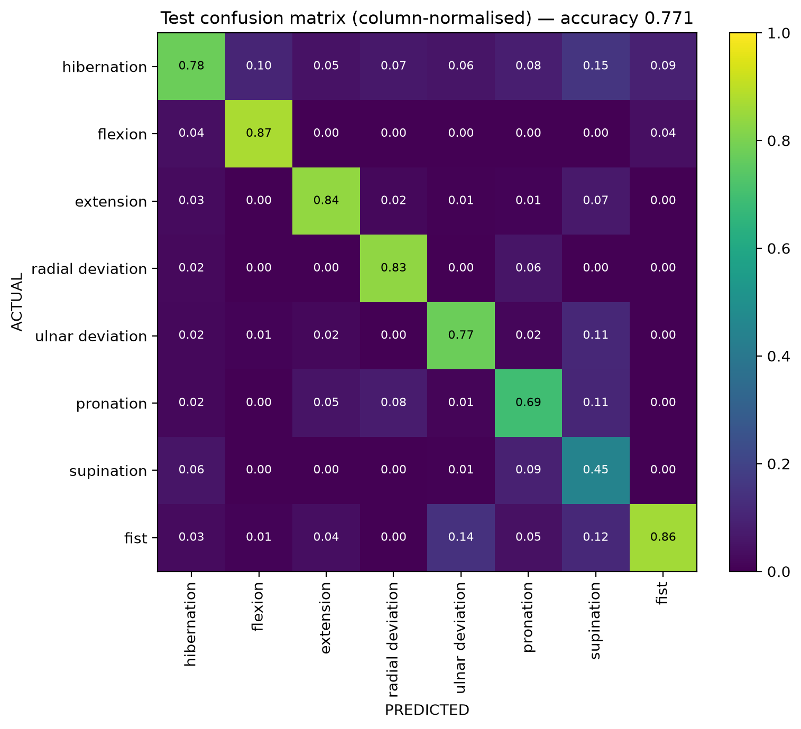
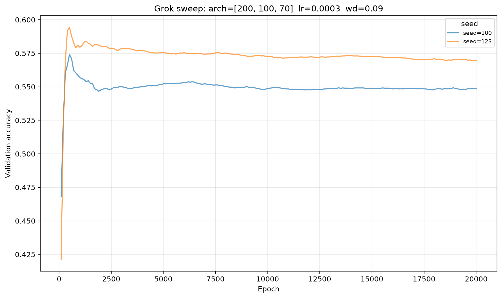
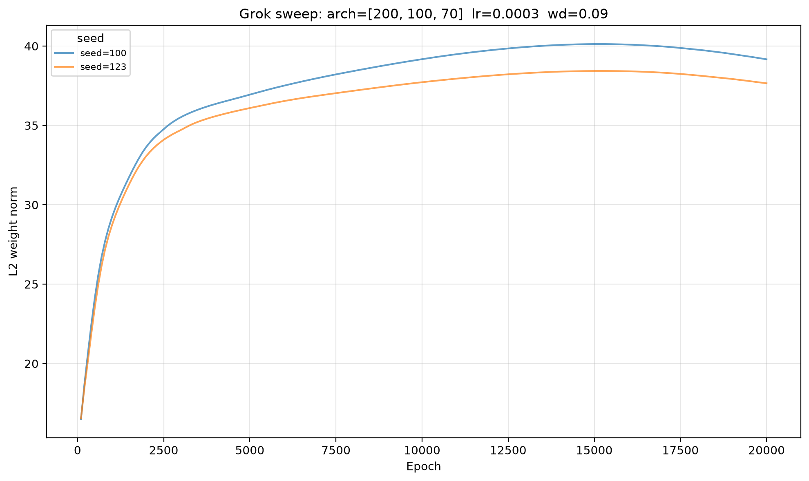
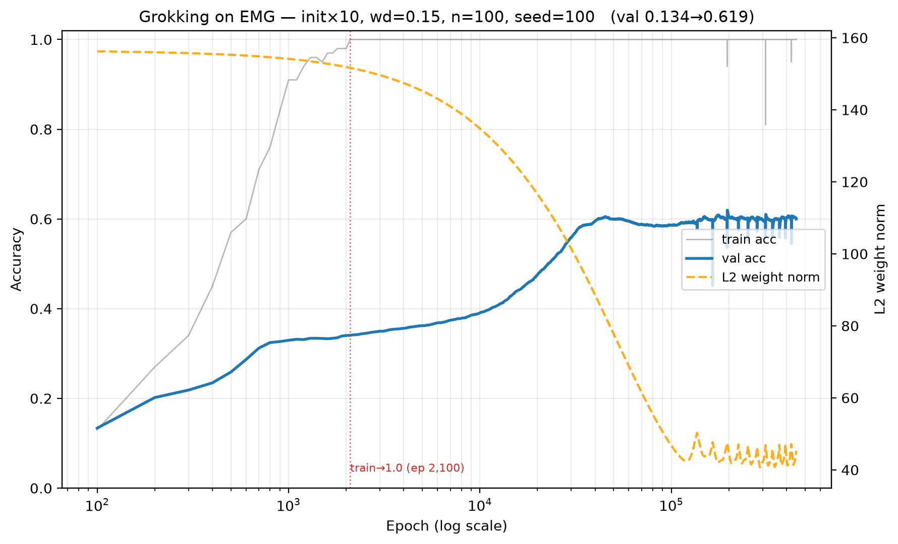

# myo-keras

EMG gesture classification on Myo armband data — and an attempt to produce **grokking** on it.

Two things live here. The first is an ordinary supervised classifier: a dense network that reads
8-channel surface EMG and predicts which of 8 hand gestures is being held. The second is a
27-run investigation into whether *grokking* — delayed generalisation, normally demonstrated on
algorithmic toy tasks — can be produced on real physiological signal. It can, in shape if not in
payoff, and the write-up below is the honest account of how, including everything that failed.

Everything runs from [`myo-keras.ipynb`](myo-keras.ipynb), top to bottom.

---

## Read the metrics before the numbers

This dataset is **~56% `hibernation`** (the resting class). That single fact decides which accuracy
number means what, and mixing the two is the easiest way to draw a wrong conclusion here:

| Scored on | Uniform chance | Majority-class floor | Used by |
|---|---|---|---|
| The **full** val/test splits | 0.125 | **0.562 / 0.564** | baseline classifier, [`ceiling_baseline.py`](ceiling_baseline.py) |
| The **class-balanced** 8000-row val subsample (1000/class) | 0.125 | **0.125** | every grokking run, [`baseline_check.py`](baseline_check.py) |

A model that only ever says "hibernation" scores **0.564** on the full test split and **0.125** on
the balanced subsample. So plain accuracy on the full splits is *not* comparable to any grokking
number. The comparable pair is **balanced accuracy** (macro recall) on the full splits, or the same
model re-scored on the balanced subsample. Both are reported below.

## Results at a glance

| | protocol | plain accuracy | balanced accuracy |
|---|---|---|---|
| **Baseline classifier** (this notebook, full data) | within-subject cross-session | **0.771 test** (floor 0.564) | **0.585 test** |
| **Ceiling** — good model, full data ([`ceiling_baseline.py`](ceiling_baseline.py)) | within-subject cross-session | **0.811 test** / 0.856 val | **0.668 test** |
| **Ceiling** — same model, re-scored on the grok's own balanced 8000-row val subsample | within-subject cross-session, val | — | **0.760** ‡ |
| **Ceiling** — good model, full data | leave-one-subject-out, 5-fold | 0.650 ± 0.077 test | **0.358 ± 0.173** † |
| **Grokking run** — 100 training samples, 450k epochs | within-subject cross-session, val | — | **0.583 final** (band 0.55–0.59) |
| Vanilla net, *same* 100 samples, best point on its trajectory | within-subject cross-session, val | — | 0.574 @ epoch 950 |
| Chance | | 0.125 | 0.125 |

† **Read the LOSO row through the balanced column, and it is bleak.** 0.650 plain looks like a
respectable cross-subject result; it sits barely above the 0.564 majority-class floor. Balanced
accuracy across the five folds is **0.358 ± 0.173**, and the per-fold spread is the story:

| held-out subject | plain test | balanced test |
|---|---|---|
| 12345 | 0.5455 | **0.1224 — at chance** |
| 21547 | 0.7747 | 0.6275 |
| 45612 | 0.6839 | 0.4580 |
| 54321 | 0.6386 | 0.3286 |
| 78945 | 0.6081 | 0.2514 |

One subject is at the 0.125 chance line while scoring 0.5455 plain — that model has essentially
learned "predict hibernation" and nothing else. Cross-subject transfer on this dataset is weak and
wildly subject-dependent, which the single 0.65 ± 0.07 figure hides completely. Everything else in
the project is within-subject, so this does not touch the grokking result — but it is the number to
quote if anyone asks whether this generalises to a new wearer.

‡ That subsample is drawn from the same `-2` val split the ceiling model early-stops on, so 0.760
is mildly optimistic. The selection is a max over ≤300 epochs on 479,667 rows, worth ~1e-3, and the
grok's 0.583 is scored on the identical rows — so the +0.18 gap is not an artefact of it. But the
strictly held-out ceiling number is the 0.668 balanced test figure, not this one.

Every number in this table comes from the current code under the `keras.utils.set_random_seed` fix
— see [Reproducibility](#reproducibility).

The grokking result is a **dynamics** result, not a performance result. Both facts are in the
write-up below, in that order.

---

## Setup

Expects the [myo-readings-dataset](https://github.com/aljazfrancic/myo-readings-dataset) checked out
alongside this repo:

```
.
├── myo-keras/              <- this repo
└── myo-readings-dataset/
    ├── _readings_right_hand/
    └── curated.txt
```

Then open [`myo-keras.ipynb`](myo-keras.ipynb) and run cells top to bottom. The first cell installs
[`requirements.txt`](requirements.txt).

**Runtime:** the committed run took **~4 h 02 m** end to end on a 6-core / 12-thread CPU (i7-9750H)
— 19 m 03 s for the sweep, 3 h 40 m 19 s for the 450k-epoch grokking run, ~3 min for the baseline
classifier and ~5 s to load the data. That works out to **~29 ms per full-batch epoch** (29.4 on the
grokking run, 28.6 on the sweep).

Earlier runs on **the same box** were much slower, and it is worth knowing why before you budget.
P11 ran a configuration byte-identical to the committed one — same 450k epochs, same `log_every`,
same 8000-row val — in 10 h 53 m, i.e. **87 ms/epoch**, a 2.96× gap. Enabling the CPU `performance`
governor accounts for part of that, but not all: the three earlier measurements of the same code
came in at 76.6, 83.8 and 87.0 ms/epoch, a 14% spread that hardware cannot produce. The rest is
thermal throttling or background load. So treat the historical wall times quoted for P8–P11 as
upper bounds measured under unknown conditions rather than a per-epoch rate — and if your own run
lands near 80 ms/epoch, check your governor and what else is on the CPU before blaming the machine.

To shorten it, set `GROKKING_PILOT_EPOCHS` down in [`myo_utils.py`](myo_utils.py) — memorisation and
the grokking rise are both over by 60k epochs (the last ~0.02 of validation arrives much later, as a
slow drift after ~230k).

**CPU is faster than GPU here.** The workloads are small dense models with full-batch updates and
periodic validation, not large batched matmuls, so the CPU TensorFlow stack in `requirements.txt` is
both the documented setup and the practical default.

### Project structure

| File | Description |
|---|---|
| [`myo-keras.ipynb`](myo-keras.ipynb) | Everything: data, baseline classifier, both grokking experiments |
| [`myo_utils.py`](myo_utils.py) | Constants and all hyperparameters, RMS, data loading, auto-curation |
| [`grokking.py`](grokking.py) | Model build, sweep/pilot runners, run summaries, plot helpers |
| [`ceiling_baseline.py`](ceiling_baseline.py) | What the task *actually* supports — within-subject and LOSO |
| [`baseline_check.py`](baseline_check.py) | What a vanilla net gets on the grok's exact 100-sample split |
| [`requirements.txt`](requirements.txt) | TensorFlow, NumPy, Matplotlib, scikit-learn |

The two `*_baseline` / `*_check` scripts are standalone — run them from the shell, not the notebook.
They write `ceiling_out.log` / `baseline_out.log`, which are gitignored, so their numbers are quoted
here rather than committed.

### Data and splits

Features are a **causal** sliding-window RMS over each of the 8 EMG channels, normalised by 128 —
no future sample ever enters a feature. The window is `RMS_WINDOW_SIZE` = 80 for the baseline
classifier and `GROKKING_RMS_WINDOW` = 30 for everything grokking-related, including both baseline
scripts.

Sessions split deterministically by directory suffix: `-1` train, `-2` validation, `-3` test. The
three splits are loaded by independent calls and **never concatenated then shuffled**, so the
window-overlap leak that would otherwise contaminate a sliding-window pipeline cannot happen. The
asterisk worth stating plainly: this is **within-subject cross-session** (same five participants,
different recording days), not leave-one-subject-out. `ceiling_baseline.py` reports both, and its
LOSO folds hold a whole *participant* out of the training pool for early stopping for the same
reason.

---

## The baseline classifier

`Dense(200) → Dense(100) → Dense(70) → softmax(8)` on the 8-dim RMS features, Adam at 1e-3, early
stopping on validation loss. Trained on the full curated data; runs 6 epochs and reloads the
best-val-loss epoch, reaching **0.771 test accuracy / 0.585 balanced**, with 0.816 validation
accuracy at that epoch.



Two things are worth reading next to that headline. First, the majority-class floor is 0.564, so
0.771 is a smaller win than it looks — **balanced accuracy is 0.585**, and macro-F1 is 0.65. Recall
is 0.95 for hibernation but 0.30–0.69 for the **seven** active gestures, with `supination` worst at
0.30. The aggregate number flatters the model.

Second, `save_best_only=True` on the checkpoint is load-bearing. `ModelCheckpoint` defaults to
overwriting every epoch, so a plain checkpoint plus `load_weights()` restores the *last* epoch, not
the best. Here validation loss is lowest at epoch 1 and climbs monotonically afterwards, so the last
epoch is the most overfit model in the run: reloading it gives 0.742 test / 1.64 test loss instead
of 0.771 / 0.85. The cell is also seeded — with `keras.utils.set_random_seed(0)`, which unlike
`tf.random.set_seed` does fix the Keras initializer — because unseeded reruns spread over
~0.72–0.78 test accuracy. It reproduces to four decimals.

For the strongest number this task supports, see `ceiling_baseline.py`, which switches to the RMS-30
features and adds z-scoring, dropout and a wider net (so it is not a pure model-quality comparison —
the features differ too), and reports leave-one-subject-out as well: **0.811 test / 0.856 val**
within-subject, **0.668** balanced. Cross-subject it manages 0.650 ± 0.077 plain but only
**0.358 ± 0.173** balanced — see the footnote on the results table.

---

# Grokking on EMG

## What grokking is, and what showing it requires

**Grokking** (Power et al., 2022) is delayed generalisation. A network memorises its training set —
train accuracy 1.0, validation near chance — sits on a flat low plateau for far longer than
memorisation took, and then, with train accuracy *already pinned at 1.0*, validation accuracy
suddenly climbs. Because train accuracy cannot go up, the improvement is not "more fitting"; the
network has reorganised into a genuinely different, simpler solution.

| Phase | Train accuracy | Val accuracy | Weight norm |
|---|---|---|---|
| 1 — Memorisation | rapid rise to ~100% | stays low | growing |
| 2 — Plateau | ~100% | unchanged | slowly declining |
| 3 — Grokking | ~100% | sudden jump upward | declining further |

(The weight-norm column is the Omnigrok reading of the phenomenon, which is the one this project
tests; Power et al.'s original demonstration does not turn on norm compression.)

It is nearly always shown on algorithmic tasks (modular arithmetic and friends) — Omnigrok is the
exception that took it to MNIST and friends, and supplies the lever used here. The goal was to
produce it on this real 8-channel EMG dataset — and *only* on this dataset. Switching to a toy task
to "calibrate" was ruled out from the start; that forfeits the entire point.

Three conditions must hold **simultaneously**:

1. **Validation pinned low right after memorisation** — there has to be somewhere to jump *from*.
2. **A generalising solution behind an optimisation barrier** that memorisation does not cross.
3. **A weight-norm compression path** — the generalising solution lives at a *smaller* norm than
   the memorising one, and weight decay drives the network down through it.

## Part one — the natural-initialisation sweep (the negative result)

The textbook setup: subsample training data hard (100 samples, ~12 per class), full-batch AdamW with
weight decay, no early stopping, train orders of magnitude past convergence. 15 runs —
wd ∈ {0.09, 0.10, 0.11} × 5 seeds, arch [200,100,70], lr 3e-4, 100k epochs each. All validation
numbers in this section are on the class-balanced 8000-row subsample, so 0.125 is the true floor.

**It does not grok.** What it produces is *delayed-generalisation drift*. From the committed
two-seed, 20k-epoch pass:

| run | memorised | plateau val | best 10k rise | corr(val, ‖w‖) | ‖w‖ start→end | peak val | final val |
|---|---|---|---|---|---|---|---|
| natural init, wd=0.09, seed 100 | ep 1,500 | 0.542 ± 0.002 | **+0.003** | −0.34 | 17 → 39 | 0.564 @ **ep 400** | 0.542 |
| natural init, wd=0.09, seed 123 | ep 1,300 | 0.577 ± 0.005 | **+0.000** | −0.89 | 17 → 38 | 0.586 @ **ep 1,800** | 0.542 |

- Validation is already 0.54–0.58 the moment train accuracy hits 1.0. Condition (1) fails outright.
- The largest rise anywhere after memorisation is **+0.003**. That is not a slope, let alone an edge.
- **Peak validation lands in the first 10% of the run** — epoch 400 on seed 100, *before*
  memorisation completes at 1,500, and epoch 1,800 on seed 123, some 500 epochs after it — and
  everything following it is a slow decay. Early stopping at or near memorisation beats the entire
  rest of the run. It still does at 1.2M epochs, though not literally: P8's late drift eventually
  edged **+0.006** past its epoch-400 peak (0.5901 @ 548k vs 0.5845 @ 400), which is below the 0.009
  1σ noise floor on this subsample and so not a gain this measurement can resolve. Either way it is
  a notable standalone finding about this dataset.
- The two seeds start 0.035 apart and **converge**: seed 123 decays from 0.586 all the way down to
  meet seed 100 at the same 0.542 by epoch 20k. Where a run lands here is set by the regime, not by
  the draw — the sharpest contrast with the large-init regime, where four draws of one configuration
  span ~0.03 (see [Reproducibility](#reproducibility)).
- The weight norm **grows** 17 → 38–39 and never compresses, so condition (3) fails and there is no
  mechanism for a late transition. (The −0.89 correlation on seed 123 is not evidence of one:
  validation drifts gently down while the norm drifts up, which is anti-correlation without a
  transition — the reason `grok_summary` reports correlation *next to* rise rather than on its own.)





Two behaviours quoted below come from the retired 100k-epoch runs and **do not fit inside the 20k
window plotted above**: the post-peak decay eventually bottoms out into a slow upward drift to
~0.596 (**+0.041 spread over 70,000 epochs**), and the weight norm starts oscillating with a
~25–30k quasi-period instead of continuing to rise. In the committed pass you can see the norm
crest around epoch 15k and turn over — the first quarter-cycle of that oscillation, and nothing
more. One 100k run (wd=0.10, seed 123) showed a sharper late rise (+0.042 over 10k), but it was a
*rebound* from a pre-rise dip, not a phase
transition. Ranking runs by sharpness alone finds that artefact every time; see
[measurement discipline](#measurement-discipline) below.

## The diagnosis

Two separate causes, and the second is the one that mattered.

**Why validation never sits low:** EMG RMS features live on a **smooth manifold**. Nearby inputs
share labels, so low-complexity boundaries generalise from the first gradient step. The network
never enters a pure-memorisation regime, so validation never sits near chance.

**Why the norm never compressed:** every run started at the natural Glorot initialisation, weight
norm ~16 — *already at or below the generalising norm*. Weight decay had nothing to compress
**through**. This is the precise gap in the whole project, and it went unnoticed across all 23
natural-init runs (the 15-run sweep plus pilots P1–P8).

## Part two — Omnigrok large initialisation (the result)

The fix, from Liu, Michaud & Tegmark's *Omnigrok* (2022) — the canonical way to induce grokking on
non-algorithmic data: **multiply the initial Dense kernels by `init_scale` ≫ 1**. The network starts
at a large norm with a jagged initial function, so it memorises first with validation pinned low, and
weight decay must then compress the norm down through the generalising "Goldilocks" zone.
Validation rises as it crosses. This manufactures all three missing conditions at once.

`init_scale` and `wd` are **synergistic** and have to be tuned together. P9–P11 below are the
original tuning runs, every one of them a pre-fix draw — they seeded with `tf.random.set_seed`, so
each final is one unseeded draw rather than a reproducible value; for the init×10 configuration the
four known draws span a ~0.58–0.61 band (see [Reproducibility](#reproducibility)). The committed
re-run of the P11 configuration lands at 0.583, and that is the number the result section below
reports:

| Run | Config | Outcome |
|---|---|---|
| **P9** | init×5, wd=0.3, 280k epochs (6h31m) | First real compression event: norm **78 → 28, monotone**. Validation starts *below chance* (~0.09) — large init killed the smooth-manifold shortcut. Broke the old ~0.59 band (settled ~0.602). But **no edge**: validation peaks early then declines to 0.576 as the norm keeps falling. Post-memorisation corr(val, ‖w‖) = **+0.70** — validation is a *unimodal* function of the norm, optimal at ‖w‖ ≈ 45–60, and **wd=0.3 overshot the zone**. |
| **P10a** | init×5, wd=0.12, 120k epochs | Control. Validation climbs gently to a **flat hold at ~0.576**, norm equilibrates 44–48, corr(val, ‖w‖) ≈ 0. Stable, mid-band, no edge — too little decay parks the network above the transition. |
| **P10b** | init×10, wd=0.15, 220k epochs | **The grokking shape.** See below. |
| **P11** | init×10, wd=0.15, 450k epochs (10h53m) | Extends P10b to saturation: final 0.6125, norm equilibrated ~40–44. Shape and mechanism reproduce — corr(val, ‖w‖) = **−0.85**, rise **+0.187 over epochs 5k–55k**. This is the configuration the notebook runs. |

### The result



The figure above is the committed run — init×10, wd 0.15, seed 100, 450k epochs, 3 h 40 m. It shows
the three-phase signature:

1. **Memorise** — train accuracy hits 1.0 at **epoch 1,400**. Validation starts at **0.109**, which
   on this balanced subsample is *below* the 0.125 chance line, and reaches only ~0.37. Large init
   has killed the smooth-manifold shortcut entirely.
2. **Low phase** — train stays at 1.0 while validation stays low, summarised as **0.379 ± 0.006**
   over epochs 1.4k–7.0k. Be precise about what that is: validation is **not flat** there — it
   ramps gently from ~0.37 to ~0.39, and the ±0.006 is the spread of that ramp, not scatter about
   a level. (A linear ramp spanning 0.02 has std 0.02/√12 ≈ 0.006; the natural-init runs, which
   *are* flat, sit at ±0.002.) The low phase runs to roughly epoch 10k — about **7× longer** than
   memorisation took.
3. **Grok** — validation climbs **+0.073 in the single steepest 10k-epoch window (ep 12,600 →
   22,600)** and +0.20 in total above the low phase, while train accuracy is already pinned at 1.0,
   saturating in a **~0.55–0.59 band** and finishing at **0.583**.
4. **The mechanism** — the weight norm falls **156 → 42** in mirror image over the rise, with
   **corr(val, ‖w‖) = −0.85**. That correlation is carried almost entirely by the rise itself:
   between epochs 10k and 45k the norm falls 135 → 83 and validation goes 0.40 → 0.553. After that
   the two come apart in both directions. The norm keeps falling to a floor of **~34 near epoch
   190k** while validation sits flat at ~0.56 — compression with no payoff. Then it *rebounds* and
   oscillates in **~38–48** for the last ~250k epochs, and validation quietly adds its final +0.02
   (0.563 at 225k → 0.583 at 450k) while the norm is going back **up**. That last stretch coincides
   with the onset of the train-loss spikes rather than with any compression, so read it as late
   optimiser wandering, not as more grokking. The compression that *matters* is the stretch
   overlapping the rise; the rest is the network moving around inside a Goldilocks zone wide enough
   that validation barely notices.

Read on a **log-epoch axis** it is the canonical grokking curve, and qualitatively unlike the "peak
early, then decay" of every natural-init run.

Set against the same-notebook natural-init runs, the contrast is the whole result:

| | plateau val | best 10k rise | corr(val, ‖w‖) | ‖w‖ start→end | final val |
|---|---|---|---|---|---|
| natural init (×1), wd 0.09, seed 100 | 0.542 ± 0.002 | +0.003 | −0.34 | 17 → 39 (**grows**) | 0.542 |
| natural init (×1), wd 0.09, seed 123 | 0.577 ± 0.005 | +0.000 | −0.89 | 17 → 38 (**grows**) | 0.542 |
| **large init (×10), wd 0.15, seed 100** | **0.379 ± 0.006** | **+0.073** | **−0.85** | **156 → 42 (compresses)** | **0.583** |

Note that these two regimes differ in four things, not two: `init_scale` (×1 vs ×10) and `wd` (0.09
vs 0.15) are the point, but the learning rate (3e-4 vs 1e-4, lowered for stability at large init)
and the epoch budget (20k vs 450k) differ too. It is a regime contrast, not a one-variable ablation
— see [what we did not do](#what-we-did-not-do).

**Three honest caveats.** The run *starts* below chance at 0.109, but the low phase it settles into
sits at ~0.38, not at the 0.125 line — EMG keeps some smooth-manifold generalisation even at high
norm. The rise spans ~20k epochs rather than a vertical cliff. And the "plateau" is a shallow ramp
rather than the flat line the algorithmic-task figures show. This is *grokking-shaped delayed
generalisation on real data*, not the purest algorithmic-task version.

A fourth, smaller one: train accuracy is not literally constant for 450k epochs. The linear-x panels
show a single dip to ~0.95 around epoch 255k, with recurring train-loss spikes from ~220k onward.
Those are late optimiser instabilities long after the rise, and they do not touch the 12.6k–22.6k
window the result rests on — but "train accuracy never changes" is a simplification.

## Everything we tried, and what each one disproved

27 training runs. The failures are the interesting part; each one closed a door.

| Run | What changed | Result | What it disproved |
|---|---|---|---|
| Sweep (15 runs) | wd ∈ {0.09,0.10,0.11} × 5 seeds, natural init, 100k epochs | Drift +0.041 over 70k epochs; norm oscillates 38–40 | Weight decay alone cannot produce an edge at natural init |
| **P1** | AdamW wd=0.5, n=40, 25% label noise | *Anti*-grokking: val peaks 0.40 then **decays** | High wd compresses incidental generalisation but cannot dislodge flipped-label basins |
| **P2** | AdamW wd=0.1, n=80, 30% noise, 149k epochs | Flat plateau at 0.45, **zero liftoff** | A clean low plateau with no transition — the plateau is not sufficient |
| **P3** | SGD+Nesterov, batch 16, lr 0.01, wd 0.01, 25% noise | Basin wobble then re-collapse, ceiling 0.39 | SGD noise delays basin formation; the basin still forms |
| **P4** | SGD+Nesterov + **mixup α=1.0**, wd 0.01, 25% noise | Best absolute val **0.58**, sustained 0.55–0.58 for 90k epochs | Mixup is the only thing that *partially* breaks basins — still drift, no edge |
| **P5** | mixup α=4, **wd=0**, 35% noise | Regression to 0.40; weight norm **exploded 16 → 100** | wd is load-bearing with mixup — it caps the norm-inflation escape route |
| **P6** | mixup α=4, wd 0.01, 25% noise | Small regression (0.53) | α saturates at 1.0; Beta(4,4) over-smooths with only 80 samples |
| **P7** | **arch shrink to [64,32]** (10× fewer params: 29,538 → 2,920) + mixup | *Identical* trajectory shape | **Over-parameterisation is not the bottleneck** — capacity is not the story |
| **P8** | Clean labels, wd 0.09, n=100, **1.2M full-batch steps (14h)** | Drift saturates ~500k–700k; peak 0.5901 @ 548k, final 0.5696 | **More epochs is not the answer.** 1.2M steps added +0.006 over the *pre-memorisation* peak of 0.5845 @ epoch **400** |
| **P9** | **init×5**, wd 0.3, 280k | Norm 78 → 28 monotone; band broken (~0.602); no edge | The mechanism works — but wd=0.3 overshoots the Goldilocks zone |
| **P10a** | init×5, wd 0.12, 120k | Flat hold 0.576, corr ≈ 0 | Too little decay parks the net above the transition |
| **P10b** | **init×10, wd 0.15**, 220k | **Plateau 0.35 → +0.17 rise, corr −0.85, val 0.608 still rising** | — this is the result |
| **P11** | init×10, wd 0.15, **450k** | Saturates: final 0.6125, corr −0.85 | The ~0.58–0.61 band is where this configuration lands, not an optimisation failure |

### Levers ruled out

- ❌ **Label noise of any kind** as the gap-maker. P2 and the sweep bracket the comparison: on a
  smooth-signal task, flipped labels create a permanent memorisation floor rather than a
  memorise→generalise gap, and the noisy run showed *less* late movement than the clean ones did.
  (P2 is not a clean one-variable control — it also differs in wd, n and epoch budget — but the
  direction was consistent across P1–P6.) Wrong framework for EMG.
- ❌ **wd = 0 with mixup** — weight-norm explosion (P5). Treat `wd ≥ 0.01` as non-negotiable.
- ❌ **mixup α ≥ 4** on an ~80-sample set — over-smooths (P6).
- ❌ **Shrinking the architecture** to force a plateau — no effect on shape (P7).
- ❌ **Just more epochs** at the existing config — saturates by ~500k (P8).
- ❌ **Chasing a higher validation number** — settled by the baselines below.

## The verdict — three things are true at once

**1. The split is clean.** Train/val/test are separate recording sessions, loaded independently,
never concatenated then shuffled. The temporal window-overlap leak cannot happen. The delayed rise
is real generalisation, not fit-to-leaked-neighbours. (Asterisk: within-subject, not LOSO — and the
LOSO numbers say that asterisk carries real weight, since cross-subject balanced accuracy collapses
to 0.358 ± 0.173 with one subject at chance. Nothing here claims to transfer to a new wearer.)

**2. The dynamics are real.** Large-init low phase → delayed rise → norm compression from 156 to the
Goldilocks zone, corr(val, ‖w‖) = −0.85, visibly unlike a baseline that memorises and overfits in a
few hundred epochs. The Omnigrok mechanism genuinely fires on real physiological signal.

**3. There is no measurable payoff.** Two baselines settle it, and both are scored on the grok's own
balanced 8000-row subsample so the comparison is like-for-like:

- **Matched baseline** ([`baseline_check.py`](baseline_check.py)) — a vanilla net at init×1 on the
  *exact same* 100-sample split, pipeline and seeds. Its best trajectory point is **0.574, reached
  at epoch 950** using the grok's own lr/wd; the faster lr=1e-3 configs top out at 0.561 and 0.559
  by epoch 125, and lr=3e-3 at 0.551 by epoch 75. So the grok's 0.583 final buys **+0.009 for 474×
  the compute** against the best matched baseline, or +0.022 for ~3,600× against the best of the
  quick lr=1e-3 configs (0.561, reached at epoch 125). With 1σ ≈ 0.009 on this subsample the
  difference of two runs carries σ ≈ 0.013, making these **0.7σ and 1.7σ on n=1 runs**. Neither is
  separable. Both sides of this comparison are now measured under the seeding fix, so this is the
  number the project stands on: **the 450k-epoch grok does not beat a
  950-epoch vanilla net by any margin this measurement can resolve.**

  The comparison is deliberately generous to the baseline: it gets a perfect early-stopping oracle
  (`summarize` reports the raw trajectory maximum) while the grok is quoted at its *final* epoch.
  Note also *when* the baseline peaks — epoch 950, while it does not memorise until epoch 3,950. Its
  best point comes four times **before** memorisation, so there is no post-memorisation rise at all.
  That is the natural-init "peak early, then decay" shape again, and the opposite of the grok's.
- **Ceiling baseline** ([`ceiling_baseline.py`](ceiling_baseline.py)) — a good model on the **full**
  data, re-scored on **the grok's own balanced 8000-row val subsample**, reaches **0.760**. Against
  the grok's 0.583 that is a gap of **+0.18**, an order of magnitude past the noise floor. So the
  grok's ~0.58 is the **n=100 *sample* ceiling, not the *task* ceiling**. The network is not
  wandering — it is data-starved by design — but it has no performance story at any budget.

  This is the comparison that has to be done carefully, because the obvious version of it is wrong.
  Quoting the ceiling model's **0.811 test / 0.856 val** against the grok's 0.583 compares a number
  with a 0.564 majority-class floor against one with a 0.125 floor, and proves nothing. On matched
  balanced metrics the gap is real but smaller: 0.760 vs 0.583 on the same balanced val subsample,
  or 0.668 vs 0.585 comparing balanced test accuracy between the ceiling model and this notebook's
  own full-data baseline.

**The reframe that shrinks the claim:** this is grokking-**the-dynamics**, not
grokking-**the-outcome**. In canonical grokking the train/val gap *closes* — validation climbs to
meet train. Here train is 1.0, validation saturates at ~0.58, and the gap narrows from 0.62 at the
low phase to 0.42 and then **stops**. It never closes.

The defensible sentence is: *grokking-flavoured delayed generalisation shows up cleanly on a non-toy
EMG dataset.* Not: *grokking solved EMG decoding.*

### Reproducibility

Seed with `keras.utils.set_random_seed(seed)`, never `tf.random.set_seed(seed)`. The latter does
**not** seed Keras 3's initializers, so it leaves every run drawing a fresh Glorot init while
looking seeded. Measured over 400 epochs of the matched-baseline config (val accuracy, three runs
each):

| seeding | shuffle | three runs |
|---|---|---|
| `tf.random.set_seed(100)` | on | 0.5695, 0.5616, 0.5441 |
| `tf.random.set_seed(100)` | off | 0.5606, 0.5519, 0.5394 |
| `keras.utils.set_random_seed(100)` | on | **0.5508, 0.5508, 0.5508** |

Shuffling is not the culprit; the initialisation is. `run_grok_sweep` and `run_grok_pilot` both use
the correct call, so runs are reproducible. Two things were never affected and never in doubt: the
baseline-classifier cell, which always called `keras.utils.set_random_seed(0)` and reproduces to
four decimals, and `subsample_data`, which seeds NumPy directly — so the 100-sample training split
and the 8000-row balanced val subsample have been byte-identical across every run this project ever
made. Only the network's initial weights varied.

**The notebook was re-run end to end under the fix on 2026-07-27**, and every figure and trajectory
number quoted here and in the notebook prose comes from that run. Be precise about what "reproducible"
is doing in that sentence, though:

- **Verified by re-execution.** Two things have actually been run twice and agreed. The baseline
  classifier's cell outputs are byte-identical across the pre- and post-fix runs; and
  `baseline_check.py` was run twice, all four configs reproducing every logged figure to the last
  digit, including the **0.5736 @ epoch 950** that the matched-baseline comparison above rests on.
- **Draw-independent, but executed once.** The sweep has been run only once under the fix. Its
  result is nonetheless not at the mercy of the draw: its two seeds converge on the same 0.542 final
  instead of splitting, so the number a repeat would land on is fixed by the regime. That is an
  argument, not a demonstration.
- **Inherited, not demonstrated.** The 450k-epoch headline run is n=1 at 3 h 40 m and has not been
  executed twice. Its reproducibility follows from the same seeding path that the shorter runs
  verify; nobody has watched it reproduce.

**How much a draw is worth here** is the number to keep in mind when reading the result, and the
pre-fix runs are the best evidence for it. Four independent draws of nominally the same init×10
configuration exist. The three that ran the full 450k finished at **0.6125** (P11), **0.600** and
**0.583**, with raw peaks of 0.6206, 0.619 and 0.595; the fourth (P10b) was still rising at 0.608
when it stopped at 220k. The three-phase shape, the norm
compression and corr(val, ‖w‖) ≈ −0.85 held across all of them — that is the robust part. The final
value did **not**: it spans ~0.03, more than 3σ of the 0.009 measurement noise, and far more than the
+0.009 the run beats its matched baseline by. The dynamics survive a change of draw; the performance
claim never had room to.

### Measurement discipline

Five pitfalls that cost three rounds of wrong conclusions on the sweep. `grok_summary()` in
[`grokking.py`](grokking.py) encodes the first, second and fourth; the third and fifth still have to
be applied by hand when reading its output.

1. **Do not measure net rise from val@5k** — epoch 5k is still inside the memorisation transient,
   which on these runs is a *descent*, so measuring from a point part-way down understates the gain.
   Measure from the plateau. *(Encoded: the rise search starts at 2 × the memorisation epoch.)*
2. **Do not measure from `min(val)` in the plateau** — a raw minimum is almost always a single-tick
   Bernoulli spike, which *overstates* the rise. Use the plateau **mean** or a windowed median.
   *(Encoded: `plateau_val` is a mean.)*
3. **"Sharpest late rise" ≠ "cleanest grokking shape"** — they are different runs. A sharp edge
   preceded by a drawdown is a rebound, not a phase transition. Rank by plateau-std, dip-depth, and
   sharpness *separately*; they disagree. *(Not encoded — `grok_summary` reports no dip-depth.)*
4. **Exclude the memorisation transient** when computing "max rise over window W", or the winner is
   the rebound out of the post-memorisation dip rather than a real transition. *(Encoded.)*
5. **Know the noise floor, in both directions.** On the 8000-row validation subsample at p ≈ 0.6,
   the naive 1σ is 0.0055 — but causal RMS emits one row per sample, and even after stratified
   subsampling each selected row has **1.67 overlapping neighbours on average** (77% have at least
   one). That is a design effect of ~2.7, so the **effective N is ~3,000 and 1σ ≈ 0.009**. Over
   ~4,500 logged points the largest single tick sits a couple of σ above the band by chance alone —
   which is what the committed run's `peak val` of 0.595 is: **2.8σ above the 0.55–0.59 band's
   midpoint**, and only 0.6σ above its top. `grok_summary` reports `peak_val` as a raw maximum, the
   mirror image of the plateau-min mistake in (2): quote `final_val` and the band as the result.
   *(Not encoded.)*

### What we did not do

- **Multi-seed error bands** (4 more seeds, ~4.8 h). Wired as `GROKKING_PILOT_MULTISEED` and never
  run. Once the ceiling closed the performance story, error bars on a no-performance curve stopped
  being decision-relevant — it would only make a non-result robust. The four independent draws of
  this configuration that do exist (see [Reproducibility](#reproducibility)) are a poor substitute,
  but they already bracket the final at ~0.58–0.61, which is all the band would have been used for.
- **The causal init ablation** — init×1 at the full 450k regime, ~3.7 h at 29 ms/epoch. This is the
  airtight version of "is large init load-bearing, or just an accelerant?", and it is the gap that
  makes the side-by-side a regime contrast rather than a controlled ablation. `baseline_check.py`
  hints at the answer over a much shorter budget: init×1 at the grok's own lr/wd peaked at 0.574 by
  epoch 950 — four times *before* it memorised at epoch 3,950 — so there is **no low phase and no
  post-memorisation rise**, and init looks load-bearing for the *shape*.
- **Rigid features** — raw `W×8` signal windows instead of RMS, or a much smaller RMS window, to
  remove the smooth shortcut and push the low phase toward chance. The biggest untried structural
  lever, and the one most likely to sharpen the edge.
- **Landscape knobs** — MSE loss, `use_bias=False`, GELU/SiLU, a single wide `[512]` layer.
- **Instrumentation** — per-layer norms and effective rank, and per-class validation accuracy
  (grokking often shows one class snapping into place first). Nanda et al. is the reference for
  progress measures generally; the rank/effective-rank framing comes from elsewhere in the
  literature, not from that paper.

## Reproducing a specific pass

All hyperparameters live in [`myo_utils.py`](myo_utils.py). `GROKKING_PILOT_CONFIGS` selects which
pilot(s) `run_grok_pilots()` executes:

Costs below are measured at ~29 ms/epoch (6-core / 12-thread CPU, `performance` governor, idle).
Multiply by ~3 if you are throttled or sharing the CPU — that is what the older runs in this repo
were doing.

| Set it to | What runs | Cost |
|---|---|---|
| `GROKKING_PILOT_HEADLINE` *(default)* | init×10, wd 0.15, 450k — the result | ~3.7 h |
| `GROKKING_PILOT_INIT_SWEEP` | the tuning pass: init×5/wd 0.12 control, then init×10/wd 0.15 | ~2.8 h |
| `GROKKING_PILOT_MULTISEED` | 4 extra seeds at 150k for an error band | ~4.8 h |

The natural-init sweep is configured separately by `GROKKING_ARCHITECTURES` × `GROKKING_LRS` ×
`GROKKING_WEIGHT_DECAYS` × `GROKKING_SEEDS` (any list may have length 1). The notebook ships a
trimmed two-seed, 20k-epoch pass (19 min measured); the original was wd ∈ {0.09, 0.10, 0.11} ×
5 seeds × 100k epochs and reached the same conclusion.

`run_grok_sweep` calls `keras.utils.set_random_seed(seed)` before each build and prints per-run wall
time. Use that, not `tf.random.set_seed` — see [Reproducibility](#reproducibility) above.
For reproducibility across machines, confirm `curated.txt` in the dataset repo has not changed since
your reference run — regenerating it with `generate_curated()` changes which sessions enter the split.

### Key parameters

| What | Constant | Role |
|---|---|---|
| Initial weight scale | `GROKKING_PILOT_INIT_SCALE` | **The lever.** Multiplies Dense kernels (not biases) after build. ×10 → starting norm ~156 |
| Weight decay | `GROKKING_PILOT_WD` | Must be tuned *with* init_scale — sets where the norm equilibrates relative to the Goldilocks zone |
| Learning rate | `GROKKING_PILOT_LR` | 1e-4; lowered from the sweep's 3e-4 for stability at large init |
| Epochs | `GROKKING_PILOT_EPOCHS` | No early stopping. Full-batch, so one optimizer step per epoch |
| Train subset | `GROKKING_TRAIN_SUBSET` (sweep), `GROKKING_PILOT_TRAIN_SUBSET` (pilots) | Stratified subsample, n=100 (12–13 per class) |
| Val subset | `GROKKING_VAL_SUBSET` | Stratified, 8000 — exactly 1000 per class, so the floor is 0.125 |
| Log / eval cadence | `GROKKING_LOG_EVERY`, `GROKKING_PILOT_LOG_EVERY` | Training runs every epoch; metrics are *recorded* at multiples of this and the final epoch |
| RMS window (grok reload) | `GROKKING_RMS_WINDOW` | 30, for the grokking data load only |
| Label noise, mixup | `GROKKING_PILOT_LABEL_NOISE`, `..._MIXUP_ALPHA` | Dead ends here; wired for reproduction of P1–P6 |

### Plots

`plot_grok_logx` is the canonical view (log-epoch, accuracy + weight norm, memorisation marked).
`plot_grok_pilot` is the linear-x diagnostic set. `plot_grok_seed_overlay`,
`plot_grok_run_loss_accuracy` and `plot_grok_run_valacc_weight_norm` cover the sweep;
`plot_grok_logx_overlay` overlays several runs with their mean. All accept `savepath`; the notebook
writes every figure in this README into `pics/`.

## References

- Power, A., Burda, Y., Edwards, H., Babuschkin, I., & Misra, V. (2022). *Grokking: Generalization
  Beyond Overfitting on Small Algorithmic Datasets*. [arXiv:2201.02177](https://arxiv.org/abs/2201.02177)
- Liu, Z., Michaud, E. J., & Tegmark, M. (2022). *Omnigrok: Grokking Beyond Algorithmic Data*.
  [arXiv:2210.01117](https://arxiv.org/abs/2210.01117)
- Nanda, N., Chan, L., Lieberum, T., Smith, J., & Steinhardt, J. (2023). *Progress Measures for
  Grokking via Mechanistic Interpretability*. [arXiv:2301.05217](https://arxiv.org/abs/2301.05217)
- Loshchilov, I., & Hutter, F. (2019). *Decoupled Weight Decay Regularization*. ICLR 2019.

---

## Appendix

### Auto-curation

`curated.txt` lists the *sessions* — three lines per participant, `{id}-1/-2/-3` — of the
participants whose per-participant test accuracy clears `CURATION_ACCURACY_THRESHOLD` (default 0.7).
Five participants pass, giving 15 lines. To regenerate it — note this **writes into the dataset
repo** and can change which sessions enter the splits:

```python
generate_curated()  # uses READINGS_DIR, CURATED_FILE, CURATION_ACCURACY_THRESHOLD
```

Optional arguments: `generate_curated(readings_dir=..., output_file=..., accuracy_threshold=...)`.

### Gesture labels

| Index | Gesture | | Index | Gesture |
|---|---|---|---|---|
| 0 | hibernation | | 4 | ulnar deviation |
| 1 | flexion | | 5 | pronation |
| 2 | extension | | 6 | supination |
| 3 | radial deviation | | 7 | fist |
